```mermaid
%%{init: {'theme':'dark', 'themeVariables': {'primaryColor':'#14b8a6','primaryBorderColor':'#14b8a6','lineColor':'#4ade80','primaryTextColor':'#e5e7eb','background':'#0d1117'}}}%%
flowchart LR
    subgraph CTX["live context · data.gov.sg"]
        W[weather]
        T[time]
        C[camera ID]
        R[resolution]
        A[PM2.5]
    end
    CTX --> ENC["context encoder<br/>(MLP → γ, β)"]
    IMG["camera frame"] --> YOLO["YOLOv11<br/>backbone"]
    YOLO --> F1["FiLM<sub>P3</sub>"]
    YOLO --> F2["FiLM<sub>P4</sub>"]
    YOLO --> F3["FiLM<sub>P5</sub>"]
    ENC --> F1 & F2 & F3
    F1 & F2 & F3 --> H[detection head]
    H --> OUT["vehicles<br/>plates<br/>tracks"]

    style CTX fill:#0d1117,stroke:#14b8a6
    style ENC fill:#14b8a6,color:#fff,stroke:#14b8a6
    style F1 fill:#14b8a6,color:#fff,stroke:#14b8a6
    style F2 fill:#14b8a6,color:#fff,stroke:#14b8a6
    style F3 fill:#14b8a6,color:#fff,stroke:#14b8a6
    style OUT fill:#4ade80,color:#0d1117,stroke:#4ade80
```

<div align="center">


<br/>

<a href="mailto:sdonthi4@asu.edu"></a>
&nbsp;
<a href="https://linkedin.com/in/suhas-reddy-msds/"></a>
&nbsp;
<a href="https://github.com/Suhxs-Reddy"></a>

<br/>
<br/>


</div>

<br/>

> MS Data Science at Arizona State University. I work at the seam between AI and the world it has to live in — where the deployment is always weirder than the paper, and the interesting part is never the model. **It's noticing what the model can't see.**

<br/>

<div align="center">


</div>

<br/>

---

<br/>

## &nbsp; Featured work

<br/>

<table>
<tr>
<td width="50%" valign="top">

###  &nbsp;[CATI](https://github.com/Suhxs-Reddy/sg-smart-city-analytics) <sub>Singapore traffic intelligence</sub>

A traffic detector that adapts in real time to weather, time of day, and which camera the frame came from. One model — not ninety.

FiLM layers ([Perez et al., 2018](https://arxiv.org/abs/1709.07871)) modulate YOLOv11's backbone features using live signals from Singapore's national APIs. ~130K extra parameters on 9.4M. The model starts as vanilla YOLO and only specializes where it helps loss.

<sub>`PyTorch` · `YOLOv11` · `FiLM` · `BoT-SORT` · `data.gov.sg` · `Docker`</sub>

</td>
<td width="50%" valign="top">

###  &nbsp;[COLLIDE](https://github.com/Suhxs-Reddy/EnergyHackathon) <sub>AI siting for gigawatt data centers</sub>

Where should you build a 100 MW behind-the-meter gas plant? Three ML models (land · gas · power) argue through TOPSIS, a LangGraph agent answers what-ifs in plain English, and Monte Carlo gives you P10/P50/P90 over 20 years.

10 live data sources. 72-hour LMP forecast via Moirai. What takes consulting firms months happens in seconds.

<sub>`FastAPI` · `LangGraph` · `Claude` · `DuckDB` · `SHAP` · `KDE` · `Monte Carlo`</sub>

</td>
</tr>
<tr>
<td width="50%" valign="top">

###  &nbsp;[DataGuard](https://github.com/Suhxs-Reddy/KiroHackathon) <sub>Chrome extension</sub>

Llama 3.1 reads the privacy policy you never will. Breach-checks on Have I Been Pwned, one-click GDPR/CCPA opt-outs with pre-filled emails.

<sub>`TypeScript` · `Chrome MV3` · `Llama 3.1 8B`</sub>

</td>
<td width="50%" valign="top">

###  &nbsp;[AI Study Buddy](https://github.com/Suhxs-Reddy/CBC-Hackathon) <sub>Canvas LMS × Claude</sub>

A RAG tutor that knows when to shut up — retrieves only from your real course docs, flags out-of-syllabus questions instead of inventing answers.

<sub>`React` · `FastAPI` · `Claude` · `Supermemory`</sub>

</td>
</tr>
</table>

<br/>

<details>
<summary>&nbsp; <b>↳ &nbsp; more projects</b></summary>

<br/>

| Project | What it does | Stack |
|---|---|---|
| [Hospital Clustering](https://github.com/Suhxs-Reddy/DShospitalproject) | Unsupervised patient pattern discovery | `scikit-learn` |
| [Walmart Forecast](https://github.com/Suhxs-Reddy/prediction) | Store-level weekly demand, 45 stores | `Python` · `time-series` |

</details>

<br/>

---

<br/>

<details>
<summary>&nbsp; <b>↳ &nbsp; under the hood — CATI architecture</b></summary>

<br/>



```
feature_out = γ(context) ⊙ feature_in + β(context)
```

A tiny MLP processes weather, temperature, sin/cos hour-of-day, 16-dim camera ID embedding, resolution, and PM2.5 → predicts γ and β for the P3/P4/P5 stages. Identity init (γ=1, β=0) means day zero = vanilla YOLO. Total overhead: ~130K params on 9.4M.

</details>

<br/>

<details>
<summary>&nbsp; <b>↳ &nbsp; under the hood — COLLIDE pipeline</b></summary>

<br/>



```mermaid
%%{init: {'theme':'dark', 'themeVariables': {'primaryColor':'#f59e0b','primaryBorderColor':'#f59e0b','lineColor':'#4ade80','primaryTextColor':'#e5e7eb','background':'#0d1117'}}}%%
flowchart LR
    subgraph SRC["10 public data sources · live"]
        S1[PHMSA pipelines]
        S2[ERCOT / CAISO]
        S3[county GIS]
        S4[Waha hub]
    end
    SRC --> M1["Land<br/>Random Forest"]
    SRC --> M2["Gas<br/>GPU KDE"]
    SRC --> M3["Power<br/>RF + GMM"]
    M1 & M2 & M3 --> TOP["TOPSIS<br/>composite"]
    TOP --> AGT["LangGraph<br/>agent · Claude"]
    AGT --> UI["map UI<br/>scorecard + NPV"]

    style SRC fill:#0d1117,stroke:#f59e0b
    style M1 fill:#1f2937,color:#f59e0b,stroke:#f59e0b
    style M2 fill:#1f2937,color:#f59e0b,stroke:#f59e0b
    style M3 fill:#1f2937,color:#f59e0b,stroke:#f59e0b
    style TOP fill:#f59e0b,color:#0d1117,stroke:#f59e0b
    style AGT fill:#4ade80,color:#0d1117,stroke:#4ade80
    style UI fill:#4ade80,color:#0d1117,stroke:#4ade80
```

**Land** — Random Forest (300 trees, depth 8), SHAP attribution. **Gas** — GPU KDE on PHMSA incident data. **Power** — RF + 3-component GMM for market regime detection. **Composite** — TOPSIS (adjustable weights). **Agent** — LangGraph + Claude, 5 intents. **NPV** — 10K Monte Carlo scenarios, 8% WACC, 20-year horizon. **Forecast** — Moirai foundation model, 72-hour LMP with confidence bands.

</details>

<br/>

---

<br/>

<div align="center">

## &nbsp; Currently

</div>

<br/>

<table>
<tr>
<td width="50%" valign="top">

📖 &nbsp; **Reading**
- Perez et al. — *FiLM* (2018)
- Salesforce — *Moirai* foundation model
- Foundation models for physical infrastructure

</td>
<td width="50%" valign="top">

🔨 &nbsp; **Building**
- CATI → Colab A100 training → HF Spaces
- COLLIDE → CAISO + PJM expansion
- Research Assistant · ASU Health Solutions

</td>
</tr>
</table>

<br/>

---

<br/>

<div align="center">


&nbsp;&nbsp;


</div>

<br/>

<div align="center">


</div>

<br/>

---

<br/>

```
2026 → present   Research Assistant · ASU College of Health Solutions
2026             ASU Energy Hackathon · COLLIDE
2025 → 2027      MS Data Science · Arizona State University
2025             Data Science Intern · GlobalLogic
2024             SWE Intern · GlobalLogic · GenAI platform
2021 → 2025      B.Tech CS (Big Data minor) · MIT Manipal
```

<br/>

<div align="center">

<picture>
  <source media="(prefers-color-scheme: dark)" srcset="https://raw.githubusercontent.com/Suhxs-Reddy/Suhxs-Reddy/output/github-contribution-grid-snake-dark.svg" />
  
</picture>

<br/>
<br/>


<sub>built in colab notebooks · shipped on vercel · fueled by caffeine</sub>

</div>
