```mermaid
%%{init: {'theme':'dark', 'themeVariables': {'primaryColor':'#14b8a6','primaryBorderColor':'#14b8a6','lineColor':'#4ade80','primaryTextColor':'#e5e7eb','background':'#0d1117'}}}%%
flowchart LR
    subgraph CTX["live context · data.gov.sg"]
        W[weather]
        T[time]
        C[camera ID]
        R[resolution]
        A[PM2.5]
    end
    CTX --> ENC["context encoder<br/>(MLP → γ, β)"]
    IMG["camera frame"] --> YOLO["YOLOv11<br/>backbone"]
    YOLO --> F1["FiLM<sub>P3</sub>"]
    YOLO --> F2["FiLM<sub>P4</sub>"]
    YOLO --> F3["FiLM<sub>P5</sub>"]
    ENC --> F1 & F2 & F3
    F1 & F2 & F3 --> H[detection head]
    H --> OUT["vehicles<br/>plates<br/>tracks"]

    style CTX fill:#0d1117,stroke:#14b8a6
    style ENC fill:#14b8a6,color:#fff,stroke:#14b8a6
    style F1 fill:#14b8a6,color:#fff,stroke:#14b8a6
    style F2 fill:#14b8a6,color:#fff,stroke:#14b8a6
    style F3 fill:#14b8a6,color:#fff,stroke:#14b8a6
    style OUT fill:#4ade80,color:#0d1117,stroke:#4ade80
```

```mermaid
%%{init: {'theme':'dark', 'themeVariables': {'primaryColor':'#f59e0b','primaryBorderColor':'#f59e0b','lineColor':'#4ade80','primaryTextColor':'#e5e7eb','background':'#0d1117'}}}%%
flowchart LR
    subgraph SRC["10 public data sources · live"]
        S1[PHMSA pipelines]
        S2[ERCOT / CAISO]
        S3[county GIS]
        S4[Waha hub]
    end
    SRC --> M1["Land<br/>Random Forest"]
    SRC --> M2["Gas<br/>GPU KDE"]
    SRC --> M3["Power<br/>RF + GMM"]
    M1 & M2 & M3 --> TOP["TOPSIS<br/>composite"]
    TOP --> AGT["LangGraph<br/>agent · Claude"]
    AGT --> UI["map UI<br/>scorecard + NPV"]

    style SRC fill:#0d1117,stroke:#f59e0b
    style M1 fill:#1f2937,color:#f59e0b,stroke:#f59e0b
    style M2 fill:#1f2937,color:#f59e0b,stroke:#f59e0b
    style M3 fill:#1f2937,color:#f59e0b,stroke:#f59e0b
    style TOP fill:#f59e0b,color:#0d1117,stroke:#f59e0b
    style AGT fill:#4ade80,color:#0d1117,stroke:#4ade80
    style UI fill:#4ade80,color:#0d1117,stroke:#4ade80
```

<div align="center">


<br/>

<a href="mailto:sdonthi4@asu.edu"></a>
&nbsp;
<a href="https://linkedin.com/in/suhas-reddy-msds/"></a>
&nbsp;
<a href="https://github.com/Suhxs-Reddy"></a>

<br/>
<br/>


</div>

<br/>

> The data is always dirtier than you think. The deployment is always weirder than you imagined. Generic models miss the obvious because nobody told them what was obvious. I work at the seam between AI and the world it has to live in — where 90 traffic cameras include eleven 320×240 relics from the early 2000s, where pipeline incident data from 1986 changes where you'd put a gigawatt plant in 2026, where the privacy policy nobody reads is also the one selling your location. **The fun part isn't tuning the model. It's noticing what the model can't see.**

<br/>

<div align="center">


&nbsp;

&nbsp;


</div>

<br/>

---

<br/>

<div align="center">

## Featured Projects

</div>

<br/>

<!-- ═══════════════════════ CATI ═══════════════════════ -->

<table>
<tr>
<td>

### CATI &nbsp;<sub><sup>Context-Aware Traffic Intelligence · Singapore</sup></sub>

A traffic detector that adapts to weather, time, camera, and air quality in real time. FiLM layers ([Perez et al., 2018](https://arxiv.org/abs/1709.07871)) modulate YOLOv11's backbone — one model instead of ninety. ~130K extra parameters on 9.4M.

<a href="https://github.com/Suhxs-Reddy/sg-smart-city-analytics"></a> &nbsp;  &nbsp; 

<sub>`PyTorch` · `YOLOv11` · `FiLM` · `BoT-SORT` · `data.gov.sg` · `Docker` · `HuggingFace Spaces`</sub>

</td>
</tr>
</table>

<details>
<summary> &nbsp;<b>→ the full story — why I built this and how it works</b></summary>

<br/>

Singapore runs ninety traffic cameras around the clock. Some are 1080p. Eleven are 320×240 hardware from the early 2000s. They look out over monsoon storms, midnight glare, peak-hour chaos, and the dead silence at 4am. And every single frame — every camera, every condition — gets piped through the same generic YOLO that treats them all identically. Which is exactly when vehicles get missed.

I kept staring at this and thinking: **the model already has access to everything it needs to do better.** The camera knows which camera it is. The system has live weather. The clock is right there. The PM2.5 air-quality index is one public API call away. So why is a clear afternoon highway and a rain-soaked midnight feed processed the same way?

The answer turned out to live in a 2018 paper I came across — **FiLM** (*Feature-wise Linear Modulation*, [Perez et al.](https://arxiv.org/abs/1709.07871)). It's a small, beautiful idea: tiny modules that take an external signal and use it to **scale and shift the network's internal features**. Identity at initialization, so the model starts as plain YOLO and only specializes where it actually helps. No retraining. No ensemble. One model, with a dial for context.

The way to picture it: imagine the vision network as layers of pattern detectors stacked on top of each other. With FiLM, I can dial each detector's volume up or down based on the current weather, time, camera, and air quality. In monsoon rain, the detectors looking for crisp edges get turned down. The ones looking for blurry motion blobs get turned up. At 2am on Camera #47, the network behaves differently than at 2pm on Camera #12. The model figures out the dialing on its own — I just feed it the current state of the world.



</details>

<details>
<summary> &nbsp;<b>→ the math and numbers</b></summary>

<br/>

The FiLM transform is just two affine parameters per channel:

```
feature_out = γ(context) ⊙ feature_in + β(context)
```

A tiny encoder (MLP) processes weather code, temperature, sin/cos hour-of-day, a 16-dim camera ID embedding (learned per camera), resolution, and PM2.5, then predicts `γ` and `β` for the P3/P4/P5 stages of YOLOv11's backbone. Identity initialization (γ=1, β=0) means day zero is exactly vanilla YOLO — the model only specializes where it helps loss.

Total cost: ~130K extra parameters on YOLO's 9.4M. Inference cost is rounding-error.

The system is live on HuggingFace Spaces, collecting from all 90 cameras every 60 seconds — 80,000+ records and growing. Dataset publishing to Kaggle for open traffic research.

</details>

<br/>

<!-- ═══════════════════════ COLLIDE ═══════════════════════ -->

<table>
<tr>
<td>

### COLLIDE &nbsp;<sub><sup>AI siting for gigawatt data centers</sup></sub>

Where should you build a 100 MW behind-the-meter gas plant? Three ML models (land · gas · power) argue through TOPSIS, a LangGraph agent answers what-ifs in plain English, and Monte Carlo gives you P10/P50/P90 over 20 years. 10 live data sources. What takes consulting firms months happens in seconds.

<a href="https://github.com/Suhxs-Reddy/EnergyHackathon"></a> &nbsp;  &nbsp; 

<sub>`FastAPI` · `LangGraph` · `Claude` · `DuckDB` · `Leaflet` · `SHAP` · `Random Forest` · `KDE` · `GMM` · `Monte Carlo`</sub>

</td>
</tr>
</table>

<details>
<summary> &nbsp;<b>→ the full story — the three-body problem of energy siting</b></summary>

<br/>

Every AI hyperscaler needs power — gigawatts of it, twenty-four seven. Connecting a new data center to the grid takes three to seven years. Your competitors aren't waiting. So you build your own natural-gas plant on-site, behind the meter. The catch is picking *where*, and the catch is brutal: it's a three-body problem. Land has its own constraints (zoning, fiber, water, flood). Gas supply has its own (pipeline reliability, hub distance, curtailment risk). Electricity markets have their own (LMP spreads, price regimes, scarcity events). Real consultants charge six figures and take months because they evaluate these axes one at a time.

I wanted the three to **argue with each other in real time** instead of sequentially. A great parcel with bad gas economics shouldn't beat a decent parcel with stellar gas economics, but spreadsheets can't tell you that. So I gave each axis its own ML model — a Random Forest for land (interpretable, gives me SHAP), a GPU Gaussian KDE for gas pipeline reliability (because incidents cluster spatially and KDE reads that distribution out cleanly), and a Random Forest plus GMM for power markets (because electricity really does have distinct regimes — normal, wind-curtailment, scarcity — and the GMM finds them in unlabeled ERCOT data without me having to tag anything). They all feed into TOPSIS, a multi-criteria scoring method from 1981 that's still the cleanest way to combine apples and oranges with adjustable weights.

The interesting layer sits on top: a LangGraph agent running Claude. Five intents — stress-test, compare, timing, explain, configure. You ask *"what if gas prices spike 30%?"* in plain English and the system actually re-runs the analysis on live ERCOT and CAISO feeds.

The whole thing is wired to ten public data sources updating every five minutes. Click any coordinate. Get a scorecard with quantified risk, a 20-year cost forecast from 10,000 Monte Carlo simulations, and a 72-hour LMP forecast from the **Moirai foundation model**. What used to take consulting firms months happens while you're still scrolling.



</details>

<details>
<summary> &nbsp;<b>→ model specs and numbers</b></summary>

<br/>

**Land — Random Forest, 300 trees, max depth 8.** Top features by importance: highway access (28.5%), substation proximity (23.7%), pipeline distance (19.9%), water (14.6%), fiber (8.1%). SHAP for per-site attribution.

**Gas — GPU Gaussian KDE, bandwidth 0.5.** Trained on PHMSA pipeline incident coordinates (severity-weighted). Score: incident density 40% + interstate proximity 35% + Waha distance 25%.

**Power — Random Forest (200 trees, depth 6) + GMM (3 components, full covariance).** GMM trained on five ERCOT features. Cluster labels: `normal` (0), `wind_curtailment` (1), `stress_scarcity` (2). Training mean: LMP $78/MWh, wind 31%, demand 54.9 GW.

**Composite — TOPSIS** with default weights land 30% / gas 35% / power 35%, fully user-adjustable.

**NPV — Monte Carlo, 10,000 scenarios, 8% WACC, 100 MW plant assumption.** Returns P10/P50/P90 over 20 years.

**Agent — LangGraph orchestration, Claude Haiku + Sonnet.** Five intents: stress-test, compare, timing, explain, configure. Live market refresh every 5 minutes. 72-hour LMP forecast via Moirai with confidence bands.

</details>

<br/>

<!-- ═══════════════════════ OTHER PROJECTS ═══════════════════════ -->

<details>
<summary> &nbsp;<b>→ other things I've shipped</b></summary>

<br/>

<table>
<tr>
<td width="50%" valign="top">

#### [DataGuard](https://github.com/Suhxs-Reddy/KiroHackathon)
*Chrome extension · Llama 3.1*

Privacy policies are 5,000 words of legal jargon nobody reads. So you click "Accept" without knowing if a site sells your location. **I let an LLM do the reading for you** — Llama 3.1 parses the policy, breach-checks the domain on Have I Been Pwned, and generates one-click GDPR/CCPA opt-outs with pre-filled emails and follow-up reminders.

<sub>`TypeScript` · `Chrome MV3` · `Llama 3.1 8B`</sub>

</td>
<td width="50%" valign="top">

#### [AI Study Buddy](https://github.com/Suhxs-Reddy/CBC-Hackathon)
*Canvas LMS × Claude RAG*

Generic chatbots hallucinate when your course material isn't in their training data. **I built a RAG tutor that knows when to shut up** — retrieves only from your real Canvas docs, with a low-relevance threshold that flags out-of-syllabus questions instead of inventing answers.

<sub>`React` · `FastAPI` · `Claude` · `Supermemory`</sub>

</td>
</tr>
<tr>
<td width="50%" valign="top">

#### [Hospital Unsupervised Learning](https://github.com/Suhxs-Reddy/DShospitalproject)
*Patient clustering*

Pattern discovery on hospital records — finding structure in unlabeled patient data when you don't yet know what the labels should be.

<sub>`Jupyter` · `scikit-learn`</sub>

</td>
<td width="50%" valign="top">

#### [Walmart Demand Forecast](https://github.com/Suhxs-Reddy/prediction)
*Time-series · 45 stores*

Store-level weekly demand with lagged/rolling features, holiday flags, and chronological splits — the boring forecasting that actually keeps shelves stocked.

<sub>`Python` · `time-series`</sub>

</td>
</tr>
</table>

</details>

<br/>

---

<br/>

<table>
<tr>
<td width="50%" valign="top">

**Reading**
- Perez et al. — *FiLM: Visual Reasoning with a General Conditioning Layer* (2018)
- Salesforce — *Moirai* time-series foundation model
- Anything on **applying foundation models to physical infrastructure**

</td>
<td width="50%" valign="top">

**Building**
- CATI — live on HF Spaces, collecting data for Kaggle dataset publication
- COLLIDE — Vercel deploy + scaling beyond ERCOT to CAISO + PJM
- Research Assistant work at ASU College of Health Solutions

</td>
</tr>
</table>

<br/>

<details>
<summary> &nbsp;<b>→ stack</b></summary>

<br/>

<div align="center">


</div>

<br/>

| Layer | Tools |
|---|---|
| **ML / Data** | Python · PyTorch · scikit-learn · Pandas · NumPy |
| **Backend** | FastAPI · Docker · AWS (S3, Athena) · MySQL · MongoDB |
| **Frontend** | TypeScript · React · Vite · Tailwind |
| **AI** | Anthropic Claude · LangGraph · HuggingFace · Llama · YOLO |
| **Observability** | Grafana · Tableau |

</details>

<br/>

<details>
<summary> &nbsp;<b>→ the path here</b></summary>

<br/>

| | |
|---|---|
| **2026 →** | **Research Assistant** · ASU College of Health Solutions |
| **2026** | **ASU Energy Hackathon** · COLLIDE — built the whole pipeline solo |
| **2025 → 27** | **MS Data Science** · Arizona State University |
| **2025** | **Data Science Intern** · GlobalLogic · Auth/RBAC platform analytics |
| **2024** | **SWE Intern** · GlobalLogic · GenAI platform backend |
| **2021 → 25** | **B.Tech CS** (Big Data minor) · MIT Manipal |

</details>

<br/>

<div align="center">

<picture>
  <source media="(prefers-color-scheme: dark)" srcset="https://raw.githubusercontent.com/Suhxs-Reddy/Suhxs-Reddy/output/github-contribution-grid-snake-dark.svg" />
  
</picture>

<br/>
<br/>


</div>
