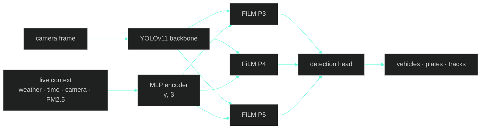
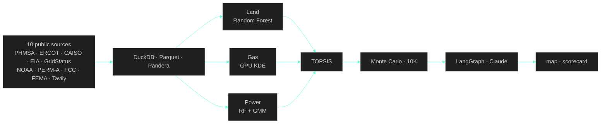

<!--
  Suhas Reddy · GitHub Profile README
  Design language:
    · single accent #64ffda (used only for: section numbers, project years, link arrows)
    · numbered section prefixes — the only structural motif
    · left-aligned, no centered content, no banners, no widgets
    · whitespace as primary element
    · one link per project, one CTA style throughout
-->

<br/>

# Hi, I'm Suhas

<sub>Applied AI engineer. MS Data Science at Arizona State University. Tempe, AZ.</sub>

<br/>

[sdonthi4@asu.edu](mailto:sdonthi4@asu.edu) &nbsp;·&nbsp; [LinkedIn](https://linkedin.com/in/suhas-reddy-msds/) &nbsp;·&nbsp; [GitHub](https://github.com/Suhxs-Reddy)

<br/>
<br/>
<br/>

## <sub><code style="color:#64ffda">01.</code></sub> &nbsp;About

The data is always dirtier than you think. The deployment is always weirder than you imagined. Generic models miss the obvious because nobody told them what was obvious.

I work at the seam between AI and the world it has to live in — where 90 traffic cameras include eleven 320×240 relics from the early 2000s, where pipeline incident data from 1986 changes where you'd put a gigawatt plant in 2026, where the privacy policy nobody reads is also the one selling your location.

The fun part isn't tuning the model. It's noticing what the model can't see.

<br/>
<br/>
<br/>

## <sub><code style="color:#64ffda">02.</code></sub> &nbsp;Featured work

<br/>

### `'26` &nbsp; CATI &nbsp; <sub><sup>— Context-Aware Traffic Intelligence</sup></sub>

A traffic detector that adapts to weather, time, camera, and air quality in real time. **FiLM** layers ([Perez et al., 2018](https://arxiv.org/abs/1709.07871)) modulate YOLOv11's backbone — one model for all 90 of Singapore's LTA cameras instead of 90 separate models. About 130K extra parameters on 9.4M. Live on HuggingFace Spaces, collecting toward a Kaggle dataset publication.

`PyTorch` &nbsp;·&nbsp; `YOLOv11` &nbsp;·&nbsp; `FiLM` &nbsp;·&nbsp; `BoT-SORT` &nbsp;·&nbsp; `data.gov.sg` &nbsp;·&nbsp; `Docker` &nbsp;·&nbsp; `HuggingFace Spaces`

[**Read the full story →**](https://github.com/Suhxs-Reddy/sg-smart-city-analytics)

<br/>

<details>
<summary><sub>The full story · how it works · the math</sub></summary>

<br/>

Singapore runs ninety traffic cameras around the clock. Some are 1080p. Eleven are 320×240 hardware from the early 2000s. They look out over monsoon storms, midnight glare, peak-hour chaos, and the dead silence at 4am. And every single frame — every camera, every condition — gets piped through the same generic YOLO that treats them all identically. Which is exactly when vehicles get missed.

I kept staring at this and thinking: **the model already has access to everything it needs to do better.** The camera knows which camera it is. The system has live weather. The clock is right there. The PM2.5 air-quality index is one public API call away. So why is a clear afternoon highway and a rain-soaked midnight feed processed the same way?

The answer turned out to live in a 2018 paper — **FiLM** (*Feature-wise Linear Modulation*). It's a small, beautiful idea: tiny modules that take an external signal and use it to **scale and shift the network's internal features**. Identity at initialization, so the model starts as plain YOLO and only specializes where it actually helps. No retraining. No ensemble. One model, with a dial for context.

Picture the vision network as layers of pattern detectors stacked on top of each other. With FiLM, I dial each detector's volume up or down based on the current weather, time, camera, and air quality. In monsoon rain, the detectors looking for crisp edges get turned down. The ones looking for blurry motion blobs get turned up. At 2am on Camera #47, the network behaves differently than at 2pm on Camera #12. The model figures out the dialing on its own — I just feed it the current state of the world.

The FiLM transform itself is two affine parameters per channel:

```
feature_out = γ(context) ⊙ feature_in + β(context)
```

A tiny encoder (MLP) processes weather code, temperature, sin/cos hour-of-day, a 16-dim camera ID embedding (learned per camera), resolution, and PM2.5, then predicts γ and β for the P3/P4/P5 stages of YOLOv11's backbone. Identity initialization (γ=1, β=0) means day zero is exactly vanilla YOLO. The model only specializes where it helps loss.

Total cost: ~130K extra parameters on YOLO's 9.4M. Inference cost is rounding-error.



</details>

<br/>
<br/>

### `'26` &nbsp; COLLIDE &nbsp; <sub><sup>— AI siting for gigawatt data centers</sup></sub>

Where do you build a 100 MW behind-the-meter gas plant? Three ML models — Random Forest, GPU Gaussian KDE, and GMM — score land, gas, and power independently, then argue through TOPSIS. A 7-node **LangGraph** agent on top of Claude answers what-ifs in plain English. Monte Carlo gives P10/P50/P90 over 20 years. Ten public data sources, refreshing every five minutes. What takes consulting firms months happens in seconds.

`FastAPI` &nbsp;·&nbsp; `LangGraph` &nbsp;·&nbsp; `Claude` &nbsp;·&nbsp; `DuckDB` &nbsp;·&nbsp; `Leaflet` &nbsp;·&nbsp; `SHAP` &nbsp;·&nbsp; `Random Forest` &nbsp;·&nbsp; `KDE` &nbsp;·&nbsp; `GMM` &nbsp;·&nbsp; `Monte Carlo`

[**Read the full story →**](https://github.com/Suhxs-Reddy/EnergyHackathon)

<br/>

<details>
<summary><sub>The full story · how it works · agent intents</sub></summary>

<br/>

Every AI hyperscaler needs power — gigawatts of it, twenty-four seven. Connecting a new data center to the grid takes three to seven years. Your competitors aren't waiting. So you build your own natural-gas plant on-site, behind the meter. The catch is picking *where*, and the catch is brutal: it's a three-body problem. Land has its own constraints (zoning, fiber, water, flood). Gas supply has its own (pipeline reliability, hub distance, curtailment risk). Electricity markets have their own (LMP spreads, price regimes, scarcity events). Real consultants charge six figures and take months because they evaluate these axes one at a time.

I wanted the three to **argue with each other in real time** instead of sequentially. A great parcel with bad gas economics shouldn't beat a decent parcel with stellar gas economics, but spreadsheets can't tell you that. So I gave each axis its own ML model — a Random Forest for land (interpretable, gives me SHAP), a GPU Gaussian KDE for gas pipeline reliability (because incidents cluster spatially and KDE reads that distribution out cleanly), and a Random Forest plus GMM for power markets (because electricity really does have distinct regimes — normal, wind-curtailment, scarcity — and the GMM finds them in unlabeled ERCOT data without me having to tag anything). They all feed into TOPSIS, a multi-criteria scoring method from 1981 that's still the cleanest way to combine apples and oranges with adjustable weights.

The interesting layer sits on top: a 7-node LangGraph StateGraph running Claude. Every query first hits a `parse_intent` node that routes to one of five tool-running nodes — *stress-test, compare, timing, explanation, config* — then converges at a synthesis node that streams the answer back as SSE tokens. You ask *"what if gas prices spike 30%?"* in plain English and the system actually re-runs the analysis on live ERCOT and CAISO feeds.

Wired to ten public data sources — PHMSA pipeline incidents, ERCOT and CAISO LMP, EIA gas prices, NOAA weather, **PERM-A** federal land ownership, FCC fiber maps, FEMA flood zones, GridStatus, and live Tavily web enrichment — refreshing every five minutes through APScheduler background jobs. Every dataset goes through Pandera schema validation; bad rows get quarantined, never silently dropped.

| Intent | Tools called | Trigger example |
|---|---|---|
| `stress_test` | `evaluate_site`, `run_monte_carlo` | *"What if gas spikes 40%?"* |
| `compare` | `compare_sites`, `evaluate_site` | *"Compare my pinned sites"* |
| `timing` | `get_lmp_forecast`, `get_news_digest` | *"When should I build?"* |
| `explanation` | SHAP from active scorecard | *"Why is land score low?"* |
| `config` | extract config JSON (Sonnet) | *"Set gas weight to 50%"* |



Background jobs: GridStatus + Waha + regime every 5 min, Tavily news every 30 min, Moirai forecast every hour. Live ERCOT LMP also pushes via WebSocket at `/ws/lmp/stream`.

</details>

<br/>
<br/>
<br/>

## <sub><code style="color:#64ffda">03.</code></sub> &nbsp;Other things I've built

<br/>

### `'25` &nbsp; DataGuard &nbsp; <sub><sup>— Chrome extension</sup></sub>

I let an LLM read the privacy policy for you. Llama 3.1 parses any site's policy, breach-checks the domain on Have I Been Pwned, and generates one-click GDPR/CCPA opt-outs.

`TypeScript` &nbsp;·&nbsp; `Chrome MV3` &nbsp;·&nbsp; `Llama 3.1`

[**Read more →**](https://github.com/Suhxs-Reddy/KiroHackathon)

<br/>

### `'25` &nbsp; AI Study Buddy &nbsp; <sub><sup>— Canvas LMS × RAG</sup></sub>

A RAG tutor that knows when to shut up. Retrieves only from your real Canvas docs, with a low-relevance threshold that flags out-of-syllabus questions instead of inventing answers.

`React` &nbsp;·&nbsp; `FastAPI` &nbsp;·&nbsp; `Claude` &nbsp;·&nbsp; `Supermemory`

[**Read more →**](https://github.com/Suhxs-Reddy/CBC-Hackathon)

<br/>

### `'25` &nbsp; Hospital Unsupervised Learning &nbsp; <sub><sup>— patient clustering</sup></sub>

Pattern discovery on hospital records. Finding structure when you don't yet know what the labels should be.

`Jupyter` &nbsp;·&nbsp; `scikit-learn`

[**Read more →**](https://github.com/Suhxs-Reddy/DShospitalproject)

<br/>

### `'24` &nbsp; Walmart Demand Forecast &nbsp; <sub><sup>— time-series, 45 stores</sup></sub>

Store-level weekly demand with lagged/rolling features and holiday flags. The boring forecasting that keeps shelves stocked.

`Python` &nbsp;·&nbsp; `time-series`

[**Read more →**](https://github.com/Suhxs-Reddy/prediction)

<br/>
<br/>
<br/>

## <sub><code style="color:#64ffda">04.</code></sub> &nbsp;Currently

**Reading.** Perez et al. on FiLM. Salesforce's Moirai paper. Anything on applying foundation models to physical infrastructure.

**Building.** CATI live on HF Spaces. COLLIDE deploying to Vercel and scaling to CAISO + PJM. Research Assistant work at ASU College of Health Solutions.

<br/>
<br/>
<br/>

## <sub><code style="color:#64ffda">05.</code></sub> &nbsp;Stack

**ML / Data.** &nbsp; Python · PyTorch · scikit-learn · Pandas · NumPy

**Backend.** &nbsp; FastAPI · Docker · AWS (S3, Athena) · MySQL · MongoDB

**Frontend.** &nbsp; TypeScript · React · Vite · Tailwind

**AI.** &nbsp; Anthropic Claude · LangGraph · HuggingFace · Llama · YOLO

**Observability.** &nbsp; Grafana · Tableau

<br/>
<br/>
<br/>

## <sub><code style="color:#64ffda">06.</code></sub> &nbsp;The path here

**`2026 →`** &nbsp; Research Assistant · ASU College of Health Solutions

**`2026`** &nbsp; ASU Energy Hackathon · COLLIDE — solo pipeline build

**`2025 → 27`** &nbsp; MS Data Science · Arizona State University · 4.0 GPA

**`2025`** &nbsp; Data Science Intern · GlobalLogic · Auth/RBAC platform analytics

**`2024`** &nbsp; SWE Intern · GlobalLogic · GenAI platform backend

**`2021 → 25`** &nbsp; B.Tech Computer Science (Big Data minor) · MIT Manipal

<br/>
<br/>
<br/>

## <sub><code style="color:#64ffda">07.</code></sub> &nbsp;Get in touch

The fastest way is [email](mailto:sdonthi4@asu.edu). Always happy to talk applied AI, computer vision, or energy infrastructure.

<br/>
<br/>
<br/>

<sub>Built in Colab. Shipped on Vercel. Designed in Tempe.</sub>
