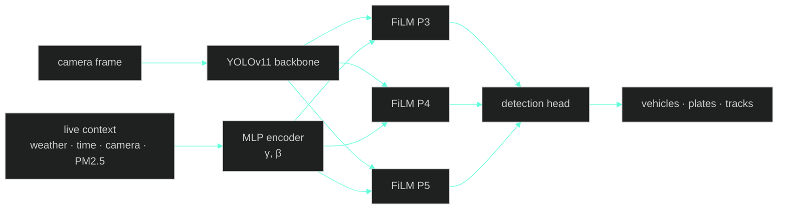
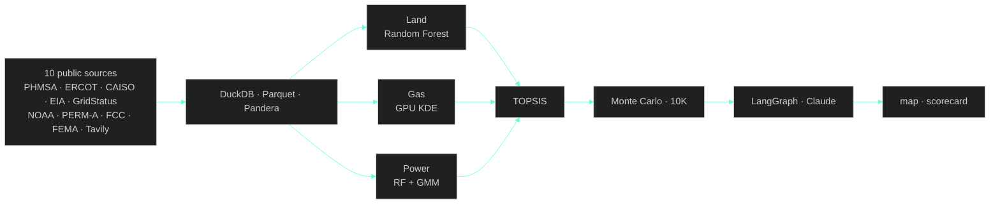

<!--
  Suhas Reddy · GitHub Profile README
  Design language:
    · primary accent: #64ffda (mint green) — section numbers, project years, primary links
    · category accents:
        - vision  → #14b8a6 (teal)
        - agents  → #a78bfa (violet)
        - energy  → #fbbf24 (amber)
        - data    → #fb7185 (coral)
    · numbered section prefixes — primary structural motif
    · year-prefixed project headers — secondary motif
    · left-aligned, no centered body content
    · whitespace as primary structural element
    · dynamic elements: typing intro · activity graph · snake · gradient project headers
-->

<br/>

# Hi, I'm Suhas

<sub>Applied AI engineer. MS Data Science at Arizona State. Tempe, AZ.</sub>

<br/>

<a href="https://readme-typing-svg.demolab.com">
  
</a>

<br/>

[sdonthi4@asu.edu](mailto:sdonthi4@asu.edu) &nbsp;·&nbsp; [LinkedIn](https://linkedin.com/in/suhas-reddy-msds/) &nbsp;·&nbsp; [GitHub](https://github.com/Suhxs-Reddy)

<br/>


&nbsp;

&nbsp;


<br/>
<br/>
<br/>

## <sub><code>01.</code></sub> &nbsp;About

The data is always dirtier than you think. The deployment is always weirder than you imagined. Generic models miss the obvious because nobody told them what was obvious.

I work at the seam between AI and the world it has to live in — where 90 traffic cameras include eleven 320×240 relics from the early 2000s, where pipeline incident data from 1986 changes where you'd put a gigawatt plant in 2026, where the privacy policy nobody reads is also the one selling your location.

The fun part isn't tuning the model. **It's noticing what the model can't see.**

<br/>
<br/>
<br/>

## <sub><code>02.</code></sub> &nbsp;Featured work

<br/>


### `'26` &nbsp; CATI &nbsp; 

<sub>Context-Aware Traffic Intelligence · Singapore · solo build · live</sub>

A traffic detector that adapts to weather, time, camera, and air quality in real time. **FiLM** layers ([Perez et al., 2018](https://arxiv.org/abs/1709.07871)) modulate YOLOv11's backbone — one model for all 90 of Singapore's LTA cameras, instead of 90 separate ones. About 130K extra parameters on 9.4M. Live on HuggingFace Spaces, collecting toward a Kaggle dataset publication.

<table><tr>
<td align="center"><h3>90</h3><sub>live LTA cameras</sub></td>
<td align="center"><h3 style="color:#14b8a6">1.4%</h3><sub>parameter overhead</sub></td>
<td align="center"><h3>80K+</h3><sub>records on HF Spaces</sub></td>
<td align="center"><h3>2018</h3><sub>FiLM, applied here first</sub></td>
</tr></table>

`PyTorch` &nbsp;·&nbsp; `YOLOv11` &nbsp;·&nbsp; `FiLM` &nbsp;·&nbsp; `BoT-SORT` &nbsp;·&nbsp; `data.gov.sg` &nbsp;·&nbsp; `Docker` &nbsp;·&nbsp; `HuggingFace Spaces`

[**Read the full story →**](https://github.com/Suhxs-Reddy/sg-smart-city-analytics)

<details>
<summary><sub>The full story · how it works · the math</sub></summary>

<br/>

Singapore runs ninety traffic cameras around the clock. Some are 1080p. Eleven are 320×240 hardware from the early 2000s. They look out over monsoon storms, midnight glare, peak-hour chaos, and the dead silence at 4am. And every single frame — every camera, every condition — gets piped through the same generic YOLO that treats them all identically. Which is exactly when vehicles get missed.

I kept staring at this and thinking: **the model already has access to everything it needs to do better.** The camera knows which camera it is. The system has live weather. The clock is right there. The PM2.5 air-quality index is one public API call away. So why is a clear afternoon highway and a rain-soaked midnight feed processed the same way?

The answer turned out to live in a 2018 paper — **FiLM** (*Feature-wise Linear Modulation*). Tiny modules that take an external signal and use it to **scale and shift the network's internal features**. Identity at initialization, so the model starts as plain YOLO and only specializes where it actually helps. No retraining. No ensemble. One model, with a dial for context.

Picture the vision network as layers of pattern detectors stacked on top of each other. With FiLM, I dial each detector's volume up or down based on the current weather, time, camera, and air quality. In monsoon rain, the detectors looking for crisp edges get turned down. The ones looking for blurry motion blobs get turned up. At 2am on Camera #47, the network behaves differently than at 2pm on Camera #12. The model figures out the dialing on its own — I just feed it the current state of the world.

```
feature_out = γ(context) ⊙ feature_in + β(context)
```

A tiny encoder (MLP) processes weather code, temperature, sin/cos hour-of-day, a 16-dim camera ID embedding (learned per camera), resolution, and PM2.5, then predicts γ and β for the P3/P4/P5 stages of YOLOv11's backbone. Identity initialization (γ=1, β=0) means day zero is exactly vanilla YOLO.



</details>

<br/>
<br/>


### `'26` &nbsp; COLLIDE &nbsp;  &nbsp; 

<sub>AI siting for gigawatt data centers · ASU Energy Hackathon 2026 · solo build</sub>

Where do you build a 100 MW behind-the-meter gas plant? Three ML models — Random Forest, GPU Gaussian KDE, and GMM — score land, gas, and power independently, then argue through **TOPSIS**. A 7-node **LangGraph** agent on top of Claude answers what-ifs in plain English. Monte Carlo gives P10/P50/P90 over 20 years. Ten public data sources, refreshing every five minutes. What takes consulting firms months happens in seconds.

<table><tr>
<td align="center"><h3>50–500</h3><sub>MW per site</sub></td>
<td align="center"><h3 style="color:#fbbf24">3 → 7</h3><sub>year grid wait, dodged</sub></td>
<td align="center"><h3>10K</h3><sub>Monte Carlo scenarios</sub></td>
<td align="center"><h3>5 min</h3><sub>live market refresh</sub></td>
</tr></table>

`FastAPI` &nbsp;·&nbsp; `LangGraph` &nbsp;·&nbsp; `Claude` &nbsp;·&nbsp; `DuckDB` &nbsp;·&nbsp; `Leaflet` &nbsp;·&nbsp; `SHAP` &nbsp;·&nbsp; `Random Forest` &nbsp;·&nbsp; `KDE` &nbsp;·&nbsp; `GMM` &nbsp;·&nbsp; `Monte Carlo`

[**Read the full story →**](https://github.com/Suhxs-Reddy/EnergyHackathon)

<details>
<summary><sub>The full story · how it works · agent intents</sub></summary>

<br/>

Every AI hyperscaler needs power — gigawatts of it, twenty-four seven. Connecting a new data center to the grid takes three to seven years. Your competitors aren't waiting. So you build your own natural-gas plant on-site, behind the meter. The catch is picking *where*, and the catch is brutal: it's a three-body problem. Land has its own constraints (zoning, fiber, water, flood). Gas supply has its own (pipeline reliability, hub distance, curtailment risk). Electricity markets have their own (LMP spreads, price regimes, scarcity events). Real consultants charge six figures and take months because they evaluate these axes one at a time.

I wanted the three to **argue with each other in real time** instead of sequentially. So I gave each axis its own ML model — a Random Forest for land (interpretable, gives me SHAP), a GPU Gaussian KDE for gas pipeline reliability (because incidents cluster spatially), and a Random Forest plus GMM for power markets (because electricity has distinct regimes — normal, wind-curtailment, scarcity — and the GMM finds them in unlabeled ERCOT data without me having to tag anything). They all feed into TOPSIS, a multi-criteria scoring method from 1981 that's still the cleanest way to combine apples and oranges with adjustable weights.

The interesting layer sits on top: a **7-node LangGraph StateGraph** running Claude. Every query first hits a `parse_intent` node that routes to one of five tool-running nodes — *stress-test, compare, timing, explanation, config* — then converges at a synthesis node that streams the answer back as SSE tokens. You ask *"what if gas prices spike 30%?"* in plain English and the system actually re-runs the analysis on live ERCOT and CAISO feeds.

Wired to ten public data sources — PHMSA pipeline incidents, ERCOT and CAISO LMP, EIA gas prices, NOAA weather, **PERM-A** federal land ownership, FCC fiber maps, FEMA flood zones, GridStatus, and live Tavily web enrichment — refreshing every five minutes through APScheduler background jobs. Pandera schema validation gates every row.

| Intent | Tools called | Trigger |
|---|---|---|
| `stress_test` | `evaluate_site`, `run_monte_carlo` | *"What if gas spikes 40%?"* |
| `compare` | `compare_sites`, `evaluate_site` | *"Compare my pinned sites"* |
| `timing` | `get_lmp_forecast`, `get_news_digest` | *"When should I build?"* |
| `explanation` | SHAP from active scorecard | *"Why is land score low?"* |
| `config` | extract config JSON (Sonnet) | *"Set gas weight to 50%"* |



Background jobs: GridStatus + Waha + regime every 5 min, Tavily news every 30 min, Moirai forecast every hour. Live ERCOT LMP also pushes via WebSocket at `/ws/lmp/stream`.

</details>

<br/>
<br/>
<br/>

## <sub><code>03.</code></sub> &nbsp;Other things I've built

<br/>

### `'25` &nbsp; DataGuard &nbsp; 

I let an LLM read the privacy policy for you. Llama 3.1 parses any site's policy, breach-checks the domain on Have I Been Pwned, and generates one-click GDPR/CCPA opt-outs with pre-filled emails and follow-up calendar reminders.

`TypeScript` &nbsp;·&nbsp; `Chrome MV3` &nbsp;·&nbsp; `Llama 3.1`

[**Read more →**](https://github.com/Suhxs-Reddy/KiroHackathon)

<br/>

### `'25` &nbsp; AI Study Buddy &nbsp; 

A RAG tutor that knows when to shut up. Retrieves only from your real Canvas docs, with a low-relevance threshold that flags out-of-syllabus questions instead of inventing answers.

`React` &nbsp;·&nbsp; `FastAPI` &nbsp;·&nbsp; `Claude` &nbsp;·&nbsp; `Supermemory`

[**Read more →**](https://github.com/Suhxs-Reddy/CBC-Hackathon)

<br/>

### `'25` &nbsp; Hospital Unsupervised Learning &nbsp; 

Pattern discovery on hospital records. Finding structure when you don't yet know what the labels should be.

`Jupyter` &nbsp;·&nbsp; `scikit-learn`

[**Read more →**](https://github.com/Suhxs-Reddy/DShospitalproject)

<br/>

### `'24` &nbsp; Walmart Demand Forecast &nbsp; 

Store-level weekly demand for 45 stores. Lagged/rolling features, holiday flags, chronological splits. The boring forecasting that keeps shelves stocked.

`Python` &nbsp;·&nbsp; `pandas` &nbsp;·&nbsp; `time-series`

[**Read more →**](https://github.com/Suhxs-Reddy/prediction)

<br/>
<br/>
<br/>

## <sub><code>04.</code></sub> &nbsp;Currently

**Reading.** &nbsp; Perez et al. on FiLM (2018). Salesforce's *Moirai* time-series foundation model. Anything on **applying foundation models to physical infrastructure** — gas, power, traffic, water.

**Building.** &nbsp; CATI live on HuggingFace Spaces, collecting from 90 cameras every 60 seconds. COLLIDE deploying to Vercel and scaling beyond ERCOT to CAISO and PJM. Research Assistant work at ASU College of Health Solutions.

**Thinking about.** &nbsp; The fact that 90% of useful ML signals are public datasets nobody bothered to wire up. The next CATI-shaped project. How to make agents that *fail* gracefully instead of hallucinating confidently.

<br/>
<br/>
<br/>

## <sub><code>05.</code></sub> &nbsp;Stack

**ML / Data.** &nbsp; Python · PyTorch · scikit-learn · Pandas · NumPy · DuckDB · Parquet

**Backend.** &nbsp; FastAPI · Docker · AWS (S3, Athena) · MySQL · MongoDB · APScheduler

**Frontend.** &nbsp; TypeScript · React · Vite · Tailwind · Leaflet · Recharts

**AI.** &nbsp; Anthropic Claude · LangGraph · LangChain · HuggingFace · Llama · YOLO

**Observability.** &nbsp; Grafana · Tableau · structured logging

<br/>
<br/>
<br/>

## <sub><code>06.</code></sub> &nbsp;The path here

**`2026 →`** &nbsp; **Research Assistant** — ASU College of Health Solutions

**`2026`** &nbsp; **ASU Energy Hackathon** — COLLIDE, solo pipeline build

**`2025 → 27`** &nbsp; **MS Data Science** — Arizona State University · 4.0 GPA

**`2025`** &nbsp; **Data Science Intern** — GlobalLogic · Auth/RBAC platform analytics (Grafana, Athena, S3)

**`2024`** &nbsp; **SWE Intern** — GlobalLogic · GenAI platform backend (FastAPI, Docker, async S3 audit)

**`2021 → 25`** &nbsp; **B.Tech Computer Science** (Big Data minor) — MIT Manipal

<br/>
<br/>
<br/>

## <sub><code>07.</code></sub> &nbsp;Get in touch

The fastest way is [**email**](mailto:sdonthi4@asu.edu). I'm always happy to talk applied AI, computer vision, energy infrastructure, or any project where the messy real world is part of the problem.

<br/>
<br/>
<br/>

<picture>
  <source media="(prefers-color-scheme: dark)" srcset="https://raw.githubusercontent.com/Suhxs-Reddy/Suhxs-Reddy/output/github-contribution-grid-snake-dark.svg" />
  
</picture>

<br/>


<br/>
<br/>

<sub>Built in Colab. Shipped on Vercel. Designed in Tempe.</sub>
