<!--
  Suhas Reddy · GitHub Profile README
  Design: editorial · year-prefixed projects · single green accent · breathing room
-->

<br/>

<div align="left">

# Suhas Reddy

### <sub><sup><code>›</code></sup></sub> &nbsp;Applied AI · MS Data Science @ Arizona State

</div>

<br/>

<div align="left">

<a href="mailto:sdonthi4@asu.edu"></a>
&nbsp;
<a href="https://linkedin.com/in/suhas-reddy-msds/"></a>
&nbsp;
<a href="https://github.com/Suhxs-Reddy"></a>
&nbsp;


</div>

<br/>
<br/>
<br/>

<table>
<tr>
<td width="100" valign="top" align="right">

<sub><code>let</code></sub><br/>
<sub><code>the data</code></sub><br/>
<sub><code>lead.</code></sub>

</td>
<td valign="top">

<h2>The data is always dirtier than you think.</h2>

The deployment is always weirder than you imagined. Generic models miss the obvious because nobody told them what was obvious. I work at the seam between AI and the world it has to live in — where 90 traffic cameras include eleven 320×240 relics from the early 2000s, where pipeline incident data from 1986 changes where you'd put a gigawatt plant in 2026, where the privacy policy nobody reads is also the one selling your location.

The fun part isn't tuning the model. **It's noticing what the model can't see.**

</td>
</tr>
</table>

<br/>
<br/>
<br/>

<!-- ═══════════════════════════════════════════════════════════════════════ -->

<table width="100%">
<tr>
<td width="200" valign="top">

<sub><code>01 ───</code></sub><br/>
<h3>Selected work</h3>

<sub><sup>two flagships</sup></sub>

</td>
<td valign="top">

<br/>

### `2026` &nbsp;&nbsp;CATI

<sub>Context-Aware Traffic Intelligence · Singapore</sub>

A traffic detector that adapts to weather, time, camera, and air quality in real time. **FiLM** layers ([Perez et al., 2018](https://arxiv.org/abs/1709.07871)) modulate YOLOv11's backbone — one model for all 90 cameras instead of 90 separate models. ~130K extra parameters on 9.4M.

<table>
<tr>
<td align="center"><h2>90</h2><sub>live LTA cameras</sub></td>
<td align="center"><h2>1.4%</h2><sub>parameter overhead</sub></td>
<td align="center"><h2>80K+</h2><sub>records on HF Spaces</sub></td>
<td align="center"><h2>2018</h2><sub>FiLM, applied here first</sub></td>
</tr>
</table>

<sub>`PyTorch` · `YOLOv11` · `FiLM` · `BoT-SORT` · `data.gov.sg` · `Docker` · `HuggingFace Spaces`</sub>

<br/>

<a href="https://github.com/Suhxs-Reddy/sg-smart-city-analytics"></a> &nbsp; 

<details>
<summary><sub>read more</sub></summary>

<br/>

Singapore runs ninety traffic cameras around the clock. Some are 1080p. Eleven are 320×240 hardware from the early 2000s. They look out over monsoon storms, midnight glare, peak-hour chaos, and the dead silence at 4am. And every single frame — every camera, every condition — gets piped through the same generic YOLO that treats them all identically. Which is exactly when vehicles get missed.

I kept staring at this and thinking: **the model already has access to everything it needs to do better.** The camera knows which camera it is. The system has live weather. The clock is right there. The PM2.5 air-quality index is one public API call away. So why is a clear afternoon highway and a rain-soaked midnight feed processed the same way?

The answer turned out to live in a 2018 paper — **FiLM** (*Feature-wise Linear Modulation*). It's a small, beautiful idea: tiny modules that take an external signal and use it to **scale and shift the network's internal features**. Identity at initialization, so the model starts as plain YOLO and only specializes where it actually helps. No retraining. No ensemble. One model, with a dial for context.

The way to picture it: imagine the vision network as layers of pattern detectors stacked on top of each other. With FiLM, I can dial each detector's volume up or down based on the current weather, time, camera, and air quality. In monsoon rain, the detectors looking for crisp edges get turned down. The ones looking for blurry motion blobs get turned up. At 2am on Camera #47, the network behaves differently than at 2pm on Camera #12. The model figures out the dialing on its own — I just feed it the current state of the world.

```mermaid
%%{init: {'theme':'dark', 'themeVariables': {'primaryColor':'#14b8a6','primaryBorderColor':'#14b8a6','lineColor':'#34d399','primaryTextColor':'#e5e7eb','background':'#0d1117'}}}%%
flowchart LR
    subgraph CTX["live context · data.gov.sg"]
        W[weather]
        T[time]
        C[camera ID]
        R[resolution]
        A[PM2.5]
    end
    CTX --> ENC["context encoder<br/>(MLP → γ, β)"]
    IMG["camera frame"] --> YOLO["YOLOv11<br/>backbone"]
    YOLO --> F1["FiLM<sub>P3</sub>"]
    YOLO --> F2["FiLM<sub>P4</sub>"]
    YOLO --> F3["FiLM<sub>P5</sub>"]
    ENC --> F1 & F2 & F3
    F1 & F2 & F3 --> H[detection head]
    H --> OUT["vehicles<br/>plates<br/>tracks"]

    style CTX fill:#0d1117,stroke:#14b8a6
    style ENC fill:#14b8a6,color:#fff,stroke:#14b8a6
    style F1 fill:#14b8a6,color:#fff,stroke:#14b8a6
    style F2 fill:#14b8a6,color:#fff,stroke:#14b8a6
    style F3 fill:#14b8a6,color:#fff,stroke:#14b8a6
    style OUT fill:#34d399,color:#0d1117,stroke:#34d399
```



The FiLM transform itself is two affine parameters per channel:

```
feature_out = γ(context) ⊙ feature_in + β(context)
```

A tiny encoder (MLP) processes weather code, temperature, sin/cos hour-of-day, a 16-dim camera ID embedding (learned per camera), resolution, and PM2.5, then predicts `γ` and `β` for the P3/P4/P5 stages of YOLOv11's backbone. Identity initialization (γ=1, β=0) means day zero is exactly vanilla YOLO. The model only specializes where it helps loss. Live on HuggingFace Spaces, collecting from all 90 cameras every 60 seconds. Dataset publishing to Kaggle.

</details>

<br/>
<br/>

<sub>━━━━━━━━━━━━━━━━━━━━━━━━━━━━━━━━━━━━━━━━━━━━━━━━━</sub>

<br/>

### `2026` &nbsp;&nbsp;COLLIDE

<sub>AI siting for gigawatt data centers · ASU Energy Hackathon · solo build</sub>

Where do you build a 100 MW behind-the-meter gas plant? Three ML models (land · gas · power) argue through **TOPSIS**, a 7-node **LangGraph** agent answers what-ifs in plain English, and Monte Carlo gives you P10/P50/P90 over 20 years. 10 live data sources. What takes consulting firms months happens in seconds.

<table>
<tr>
<td align="center"><h2>50–500</h2><sub>MW per site</sub></td>
<td align="center"><h2>3 → 7</h2><sub>year grid wait, dodged</sub></td>
<td align="center"><h2>10K</h2><sub>Monte Carlo scenarios</sub></td>
<td align="center"><h2>5 min</h2><sub>live market refresh</sub></td>
</tr>
</table>

<sub>`FastAPI` · `LangGraph` · `Claude` · `DuckDB` · `Leaflet` · `SHAP` · `Random Forest` · `KDE` · `GMM` · `Monte Carlo`</sub>

<br/>

<a href="https://github.com/Suhxs-Reddy/EnergyHackathon"></a> &nbsp; 

<details>
<summary><sub>read more</sub></summary>

<br/>

Every AI hyperscaler needs power — gigawatts of it, twenty-four seven. Connecting a new data center to the grid takes three to seven years. Your competitors aren't waiting. So you build your own natural-gas plant on-site, behind the meter. The catch is picking *where*, and the catch is brutal: it's a three-body problem. Land has its own constraints (zoning, fiber, water, flood). Gas supply has its own (pipeline reliability, hub distance, curtailment risk). Electricity markets have their own (LMP spreads, price regimes, scarcity events). Real consultants charge six figures and take months because they evaluate these axes one at a time.

I wanted the three to **argue with each other in real time** instead of sequentially. A great parcel with bad gas economics shouldn't beat a decent parcel with stellar gas economics, but spreadsheets can't tell you that. So I gave each axis its own ML model — a Random Forest for land (interpretable, gives me SHAP), a GPU Gaussian KDE for gas pipeline reliability (because incidents cluster spatially and KDE reads that distribution out cleanly), and a Random Forest plus GMM for power markets (because electricity really does have distinct regimes — normal, wind-curtailment, scarcity — and the GMM finds them in unlabeled ERCOT data without me having to tag anything). They all feed into TOPSIS, a multi-criteria scoring method from 1981 that's still the cleanest way to combine apples and oranges with adjustable weights.

The interesting layer sits on top: a **7-node LangGraph StateGraph** running Claude. Every query first hits a `parse_intent` node that routes to one of five tool-running nodes — *stress-test, compare, timing, explanation, config* — then converges at a synthesis node that streams the answer back as SSE tokens. You ask *"what if gas prices spike 30%?"* in plain English and the system actually re-runs the analysis on live ERCOT and CAISO feeds.

Wired to ten public data sources — PHMSA pipeline incidents, ERCOT and CAISO LMP, EIA gas prices, NOAA weather, **PERM-A** federal land ownership, FCC fiber maps, FEMA flood zones, GridStatus, and live Tavily web enrichment — refreshing every five minutes through APScheduler background jobs. Every dataset goes through Pandera schema validation; bad rows get quarantined, never silently dropped. Click any coordinate across Texas, New Mexico, or Arizona — ERCOT or WECC market — and you get a scorecard with quantified risk, a 20-year cost forecast from 10,000 Monte Carlo simulations, and a 72-hour LMP forecast from the **Moirai foundation model**.

```mermaid
%%{init: {'theme':'dark', 'themeVariables': {'primaryColor':'#f59e0b','primaryBorderColor':'#f59e0b','lineColor':'#34d399','primaryTextColor':'#e5e7eb','background':'#0d1117'}}}%%
flowchart LR
    subgraph SRC["10 public data sources · live"]
        S1[PHMSA<br/>pipeline incidents]
        S2[ERCOT LMP]
        S3[CAISO OASIS]
        S4[EIA<br/>gas + BA demand]
        S5[GridStatus]
        S6[NOAA NWS]
        S7[PERM-A<br/>federal land]
        S8[FCC HIFLD<br/>fiber]
        S9[FEMA<br/>flood zones]
        S10[Tavily<br/>web enrichment]
    end
    SRC --> M1["Land<br/>Random Forest"]
    SRC --> M2["Gas<br/>GPU KDE"]
    SRC --> M3["Power<br/>RF + GMM"]
    M1 & M2 & M3 --> TOP["TOPSIS<br/>composite"]
    TOP --> AGT["LangGraph<br/>agent · Claude"]
    AGT --> UI["map UI<br/>scorecard + NPV"]

    style SRC fill:#0d1117,stroke:#f59e0b
    style M1 fill:#1f2937,color:#f59e0b,stroke:#f59e0b
    style M2 fill:#1f2937,color:#f59e0b,stroke:#f59e0b
    style M3 fill:#1f2937,color:#f59e0b,stroke:#f59e0b
    style TOP fill:#f59e0b,color:#0d1117,stroke:#f59e0b
    style AGT fill:#34d399,color:#0d1117,stroke:#34d399
    style UI fill:#34d399,color:#0d1117,stroke:#34d399
```



| Intent | Tools called | Trigger example |
|---|---|---|
| `stress_test` | `evaluate_site`, `run_monte_carlo` | *"What if gas spikes 40%?"* |
| `compare` | `compare_sites`, `evaluate_site` | *"Compare my pinned sites"* |
| `timing` | `get_lmp_forecast`, `get_news_digest` | *"When should I build?"* |
| `explanation` | SHAP from active scorecard | *"Why is land score low?"* |
| `config` | extract config JSON (Sonnet) | *"Set gas weight to 50%"* |

**Background jobs:** GridStatus + Waha + regime every 5 min, Tavily news every 30 min, Moirai forecast every hour. Live ERCOT LMP also pushes via WebSocket at `/ws/lmp/stream`.

</details>

</td>
</tr>
</table>

<br/>
<br/>
<br/>

<!-- ═══════════════════════════════════════════════════════════════════════ -->

<table width="100%">
<tr>
<td width="200" valign="top">

<sub><code>02 ───</code></sub><br/>
<h3>Other things</h3>

<sub><sup>built along the way</sup></sub>

</td>
<td valign="top">

<br/>

| Year | Project | Stack | One line |
|:--|:--|:--|:--|
| `2025` | **[DataGuard](https://github.com/Suhxs-Reddy/KiroHackathon)** | TS · Chrome MV3 · Llama 3.1 | I let an LLM read the privacy policy for you, then auto-generates GDPR/CCPA opt-outs |
| `2025` | **[AI Study Buddy](https://github.com/Suhxs-Reddy/CBC-Hackathon)** | React · FastAPI · Claude RAG | A Canvas LMS tutor with a low-relevance threshold — it knows when to shut up |
| `2025` | **[Hospital DS](https://github.com/Suhxs-Reddy/DShospitalproject)** | Jupyter · scikit-learn | Patient clustering on records without labeled outcomes |
| `2024` | **[Walmart Forecast](https://github.com/Suhxs-Reddy/prediction)** | Python · time-series | Store-level weekly demand. The boring forecasting that keeps shelves stocked |

</td>
</tr>
</table>

<br/>
<br/>
<br/>

<!-- ═══════════════════════════════════════════════════════════════════════ -->

<table width="100%">
<tr>
<td width="200" valign="top">

<sub><code>03 ───</code></sub><br/>
<h3>Currently</h3>

<sub><sup>now playing</sup></sub>

</td>
<td valign="top">

<br/>

**Reading**
<br/>Perez et al. — *FiLM: Visual Reasoning with a General Conditioning Layer* (2018) &nbsp;·&nbsp; Salesforce — *Moirai* time-series foundation model &nbsp;·&nbsp; anything on **applying foundation models to physical infrastructure**

<br/>

**Building**
<br/>CATI live on HF Spaces — collecting toward Kaggle dataset publication &nbsp;·&nbsp; COLLIDE — Vercel deploy + scaling beyond ERCOT to CAISO + PJM &nbsp;·&nbsp; Research Assistant work at ASU College of Health Solutions

</td>
</tr>
</table>

<br/>
<br/>
<br/>

<!-- ═══════════════════════════════════════════════════════════════════════ -->

<table width="100%">
<tr>
<td width="200" valign="top">

<sub><code>04 ───</code></sub><br/>
<h3>Stack</h3>

<sub><sup>what I reach for</sup></sub>

</td>
<td valign="top">

<br/>

|  |  |
|---|---|
| **ML / Data** | Python · PyTorch · scikit-learn · Pandas · NumPy |
| **Backend** | FastAPI · Docker · AWS (S3, Athena) · MySQL · MongoDB |
| **Frontend** | TypeScript · React · Vite · Tailwind |
| **AI** | Anthropic Claude · LangGraph · HuggingFace · Llama · YOLO |
| **Observability** | Grafana · Tableau |

</td>
</tr>
</table>

<br/>
<br/>
<br/>

<!-- ═══════════════════════════════════════════════════════════════════════ -->

<table width="100%">
<tr>
<td width="200" valign="top">

<sub><code>05 ───</code></sub><br/>
<h3>Path</h3>

<sub><sup>how I got here</sup></sub>

</td>
<td valign="top">

<br/>

|  |  |
|---|---|
| `2026 →` | **Research Assistant** · ASU College of Health Solutions |
| `2026` | **ASU Energy Hackathon** · COLLIDE — solo pipeline build |
| `2025 → 27` | **MS Data Science** · Arizona State University · `4.0 GPA` |
| `2025` | **Data Science Intern** · GlobalLogic · Auth/RBAC platform analytics |
| `2024` | **SWE Intern** · GlobalLogic · GenAI platform backend |
| `2021 → 25` | **B.Tech CS** (Big Data minor) · MIT Manipal |

</td>
</tr>
</table>

<br/>
<br/>
<br/>

<!-- ═══════════════════════════════════════════════════════════════════════ -->

<div align="center">

<picture>
  <source media="(prefers-color-scheme: dark)" srcset="https://raw.githubusercontent.com/Suhxs-Reddy/Suhxs-Reddy/output/github-contribution-grid-snake-dark.svg" />
  
</picture>

<br/>
<br/>

<sub>Built in Colab notebooks. Shipped on Vercel. Designed in Tempe.</sub>

</div>
